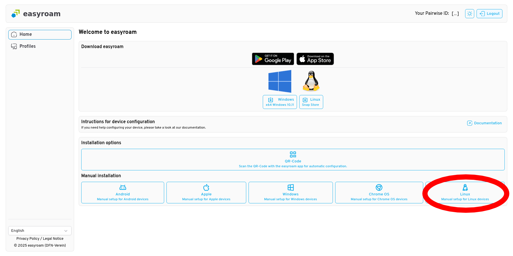

# easyroam-linux

Setup eduroam with easyroam on unsupported linux devices.

## Motivation

German universities (as of the time of writing) are switching from the official eduroam client to [easyroam](https://www.easyroam.de) by [DFN](https://www.dfn.de/) in october 2024.
Since I needed to set up Wi-Fi on my Fedora notebook, I tried to follow their guide but quickly realized that they only officially provide a .deb client for Debian-based distributions and porting the file with [alien](https://joeyh.name/code/alien/) did not work. 

So, I sent an email asking for an .rpm package, and they responded with:

> [...] uns ist es leider nicht möglich die easyroam app für RHEL/Fedora basierte Distros (.rpm Package) und/oder für die vielen anderen proprietären Linux Derivate zur Verfügung zu stellen. Das wird uns leider niemals gelingen.

which roughly translates to: _no, never_.

I started following their [guide](https://doku.tid.dfn.de/de:eduroam:easyroam#installation_der_easyroam_app_auf_linux_geraeten_network_manager) for a manual setup with NetworkManager but realized that they assume you can only use NetworkManager on Debian, which is not always the case. So, here are two small scripts to make your life easier: one for extracting certificate and key files from a PKCS#12 (.p12) bundle file, and another for directly setting up easyroam/eduroam on Fedora (and possibly other distributions as well). 

Currently, the direct setup has been tested only on Fedora with NetworkManager, but I can extend support to other distributions and other network managers if there is interest.

## Usage

You can either user `easyroam.sh` to extract the certificate files and set up your network manually, or, if you have NetworkManager installed, use `easyroam_nm.sh` to set up the network automatically.

### Obtaining your Certificate

1. Open https://www.easyroam.de
2. Click log-in and search for your university
3. Log-in through your university
4. Select `linux` in `Manual installation`
6. Enter your device name
7. Download the file by clicking on the `Ok` button



### Option 1: Automatic NetworkManger Setup
> [!WARNING]
> Tested on Fedora Workstation 42

> [!NOTE]
> For immutable distributions like Fedora Atomic Desktops, refer to [kimuraseki's fork](https://github.com/kimuraseki/easyroam-linux).

1. Download the script
    ```bash
    curl -o easyroam_nm.sh https://raw.githubusercontent.com/jahtz/easyroam-linux/main/easyroam_nm.sh
    ```
2. Make it executable:
    ```
    chmod +x easyroam_nm.sh
    ```
3. Run the setup:
    ```
    ./easyroam_nm.sh
    ```

> [!TIP]
> To remove the generated configuration, delete the file _/etc/NetworkManager/system-connections/easyroam.nmconnection_ <br>or run: `nmcli connection delete easyroam` 


### Option 2: Manual Setup
This script only unpacks the PKCS12 (.p12) file for manual network configuration
> [!TIP]
> After unpacking, you can follow the official DNF guides for:
> - [netctl](https://doku.tid.dfn.de/de:eduroam:easyroam#installation_der_easyroam_profile_auf_linux_geraeten) (e.g. Arch)
> - [wpa-supplicant](https://doku.tid.dfn.de/de:eduroam:easyroam#installation_der_easyroam_profile_auf_linux_geraeten_ohne_desktop_umgebung_wpa-supplicant_only) (e.g. Pi OS Lite)

1. Download the script
    ```bash
    curl -o easyroam.sh https://raw.githubusercontent.com/jahtz/easyroam-linux/main/easyroam.sh
    ```
2. Make it executable:
    ```
    chmod +x easyroam.sh
    ```
3. Run the setup:
    ```
    ./easyroam.sh
    ```

Resulting files:
- `easyroam_root_ca.pem` &rarr; CA certificate
- `easyroam_client_cert.pem` &rarr; User certificate
- `easyroam_client_key.pem` &rarr; Private key
